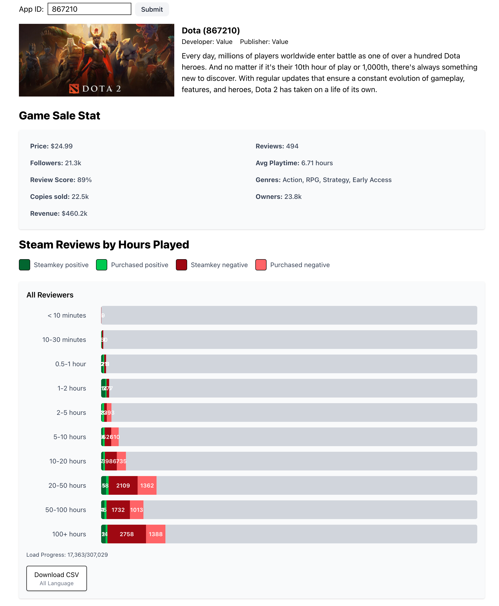

Steam game's reviews analyzer



# Usage

## Server

```bash
python -m venv venv

source venv/bin/activate

pip install -r requirements.txt
```

### Local script development

modify the **appid** you want to fetch in `main.py`

```bash
python main.py
```

### Local server development

```bash
# enter virtual environment
python app.py
```

## Client

Client part developed with React. located on `/client`

### Local Development

```bash
cd ./client

# start local dev server
pnpm dev
# or
npm run dev
```

# API list

- Get game detail: /api/game/{APP_ID}
- Get game reviews summary: /api/game/reviews/summary/{APP_ID}
- Get game review list: /api/game/reviews/{APP_ID}
- Proxy request: /proxy?url={encodeURIComponent}

# Steam related resouces

- [All supported languages constants](https://partner.steamgames.com/doc/store/localization)
